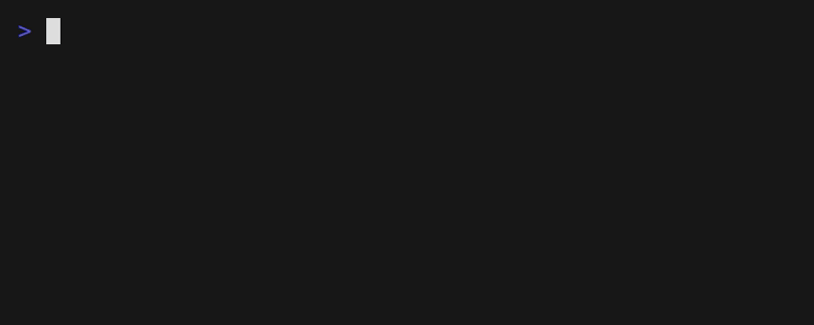

# catt

**catt** は、C と ncurses で作った小さなターミナルアニメーションコマンドです。

実行すると、猫がターミナル上を右から左へ歩きます。

[`sl`](https://github.com/mtoyoda/sl) に影響を受けた、猫版のジョークCLIです。



## 状態

現在はプロトタイプです。

実装済み:

* ターミナル上の基本アニメーション
* 猫のASCIIアート
* 歩行アニメーションフレーム
* 画面外にはみ出した場合の安全な描画
* ncurses による画面制御
* Makefile によるビルド
* ローカルインストール / アンインストール

今後追加予定:

* `-m`: `meow` と鳴く
* `-n`: 複数匹表示
* `-d`: 犬モード
* manページ

## 必要なもの

* Cコンパイラ
* ncurses
* make

Ubuntuの場合:

```bash
sudo apt update
sudo apt install build-essential libncurses-dev
```

## ビルド

```bash
make
```

## 実行

```bash
./catt
```

猫がターミナルの右側から左側へ歩いていきます。

## インストール

```bash
sudo make install
```

インストール後は、どのディレクトリからでも実行できます。

```bash
catt
```

## アンインストール

```bash
sudo make uninstall
```

## ファイル構成

```text
catt/
├── README.md
├── README-ja.md
├── LICENSE
├── Makefile
├── .gitignore
├── catt.c
├── catt.h
└── demo.gif
```

## 開発メモ

このプロジェクトは、`sl` の構造を参考にしながら、C と ncurses で小さなCLIアニメーションを作る練習として始めました。

現在の実装では、処理を以下の関数に分けています。

* `init_screen()`: ncurses の初期化
* `run_animation()`: アニメーションループ
* `draw_cat()`: 現在の猫フレームを描画
* `draw_text_safe()`: 画面内に見える文字だけを安全に描画
* `close_screen()`: ターミナル状態を元に戻す

猫のアニメーションは複数のASCIIアートフレームで構成されています。
胴体はほぼ固定し、足だけをフレームごとに変えることで歩いているように見せています。

## ロードマップ

* [x] 静止画の猫を右から左へスライドさせる
* [x] 歩行アニメーションフレームを追加する
* [x] インストールターゲットを追加する
* [ ] `-m`: `meow` と鳴く
* [ ] `-n`: 複数匹表示
* [ ] `-d`: 犬モード
* [ ] manページを追加する

## ライセンス

MIT License

